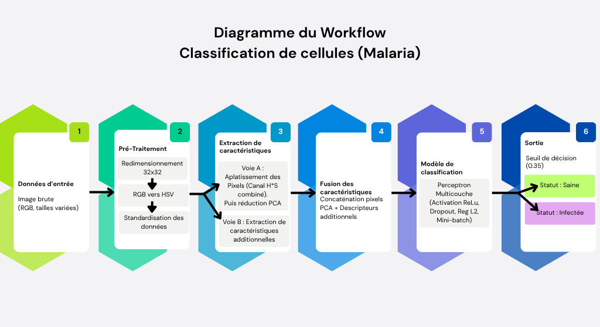

# Projet PIML 2026 - Classification de Cellules (Malaria) - Groupe 5

Si l'image ne s'affiche pas essayez de faire Ctrl+Maj+V

Objectifs :
===
Le projet consiste en l'implémentation d'un workflow complet d'apprentissage automatique pour classer des images de cellules.

Le but est de différencier automatiquement les cellules saines des cellules infectées par le parasite de la malaria, parmi de multiples échantillons issus de nombreux patients.

Pour cela, nous utilisons une approche hybride combinant des algorithmes d'extraction de caractéristiques, un modèle de Machine Learning (Perceptron Multicouche), et une visualisation des performances.

Présentation des datas :
===

Les données sur lesquelles nous travaillons sont issues du "Malaria Cell Image Dataset", qui a été publié il y a 7 ans sur la plateforme Kaggle.
* Lien : https://www.kaggle.com/datasets/iarunava/cell-images-for-detecting-malaria/data

Kaggle est une plateforme collaborative d'échanges, de publications et de cours sur les Data Sciences.

Le dataset pèse 350.95 MB et est composé de 27 558 images RGB, réparties de manière parfaitement équilibrée entre deux classes : `Infected` et `Uninfected`

Chaque image représente une seule cellule isolée, découpée d'une vue au microscope issue de frottis sanguins de patients humains.
Visuellement, les cellules infectées par la Malaria se différencient des cellules saines par la présence d'une ou plusieurs tâches violettes (le parasite Plasmodium).

Pour des raisons d'espace de stockage Git et de rapidité d'exécution, nous n'utiliserons que 2000 éléments de notre dataset (1000 par classe).

Aperçu du workflow / Intuition du processus
===

Le workflow que nous avons implémenté se sépare en 3 grandes parties :
- pré-traitement des images et descripteurs
- modèle de réseau de neurones (MLP)
- évaluation et interprétabilité

La première partie a pour but de transformer les images du dataset utilisé pour s'assurer qu'elles soient utilisable de façon optimisée par le réseau de neurones.
Les images brutes sont ainsi redimensionnées pour être du même format, puis convertie en niveau d'intensité de couleur pour supprimer le paramètre "luminosité du microscope" ; elles sont enfin normalisées.
Des descripteurs additionnels sont également calculés sur chaque image pour aider le réseau de neurones à différencier les cellules :
* des statistiques spectrales (Variance, Entropie, Skewness, Kurtosis du canal bleu).
* des analyses de couleur (Proportion de pixels violets, Moyenne de la saturation).
* des analyses de texture (Gradients).
* une analyse morphologique via une segmentation topographique (Watershed) pour compter le nombre de régions internes.

La deuxième partie a pour objectif d’implémenter un modèle de perceptron multicouches (MLP) optimal. Pour trouver le plus performant nous avons commencé par développer une architecture simple puis nous avons introduit progressivement plusieurs améliorations telles que l’utilisation de la fonction d’activation ReLU, du dropout, de la Binary Cross-Entropy et du mini-batch gradient descent. 
Afin d’optimiser les performances du réseau, nous avons implémenté une fonction qui recherche les hyper paramètres optimaux, pour le learning rate, la taille des couches cachées ainsi que la taille des batch. Les paramètres conservées sont ceux qui permettent d'obtenir la meilleur accuracy. 

La troisième partie a pour but de valider la robustesse de notre meilleur modèle et d'analyser ses performances de manière critique, en gardant à l'esprit le contexte médical du projet. Pour nous assurer que le réseau généralise bien sur de nouvelles données et ne fait pas de surapprentissage, nous utilisons une méthode de validation croisée. Les prédictions du modèle sont ensuite décortiquées grâce à plusieurs métriques clés : l'Exactitude (Accuracy), la Précision, le Rappel (Recall) et le score F1.
Une attention toute particulière est accordée au Rappel et à la matrice de confusion globale. En effet, dans le cadre du diagnostic de la malaria, il est vital de minimiser les Faux Négatifs (déclarer saine une cellule infectée).

Instructions d'installation :
===

Pour faire fonctionner le projet, une version 3.12 (ou 3.13) de Python est conseillée

Notre workflow utilise plusieurs bibliothèques de fonctions Python. Il convient donc de vérifier que les bibliothèques ci-dessous sont bien installées sur la machine où il sera exécuté, et de les installer sinon à l'aide de la commande `pip install [nom du module]`. Pour assurer la compatibilité entre ces modules, nous précisons également la version recommandée de chaque module à avoir sur l'environnement Python (les modules `os`, `sys` et `random` sont natifs à Python et ne nécessitent pas d'installation).

- `pip install numpy==1.26.4`
- `pip install scikit-image==0.24.0`
- `pip install matplotlib==3.9.0`
- `pip install scipy==1.13.1`
- `pip install scikit-learn`
- `pip install Pillow`

Une fois cela fait, il faut télécharger l'intégralité des fichiers présents sur le Git et les placer dans un même dossier en conservant l'arborescence.

Comment exécuter le Workflow :
===

Pour explorer le processus complet d'apprentissage, d'optimisation et d'évaluation :

1. Ouvrez le fichier `Workflow/Workflow.ipynb` avec Jupyter Notebook, JupyterLab ou VS Code.

2. Exécutez la Section I et II pour importer les librairies, charger le dataset, et visualiser des cellules saines et infectées, ainsi que l'ACP.

3. Exécutez la Section III pour lancer la recherche d'hyperparamètres (Random Search).

4. Exécutez la Section IV pour valider l'architecture trouvée via une Validation Croisée (K-Fold) et afficher la Matrice de Confusion.

5. Exécutez la Section V pour entraîner le modèle final sur l'intégralité des données (2000 images) et le sauvegarder sous le nom modele_de_production.npz.

Comment exécuter la démonstration :
===

La démonstration s'effectue via le notebook `Example/demo_inference.ipynb`.

1. Initialisation : Le notebook charge automatiquement le modèle entraîné (`Workflow/modele_de_production.npz`) et les paramètres de prétraitement associés.
2. Cas d'usage 1 : Diagnostic unitaire
   - Le script sélectionne aléatoirement une cellule (saine ou infectée).
   - Le modèle affiche le résultat du diagnostic avec son score de confiance (probabilité).
3. Cas d'usage 2 : Tri automatique de lot
   - Le script génère un dossier temporaire (`Temp_Test_Client`) contenant un lot de 10 cellules mélangées.
   - Le modèle trie automatiquement ces cellules dans deux sous-dossiers : `Resultats_Saines/` et `Resultats_Infectees/`.
   - Visualisation : Une grille d'images est générée directement dans le notebook pour permettre une vérification visuelle immédiate des prédictions (VP, VN, erreurs éventuelles).
4. Nettoyage : Le dossier de test temporaire est automatiquement supprimé à la fin du processus pour maintenir l'environnement propre.

> Note : Le modèle utilisé dans cette démo est une version pré-calculée. Pour explorer le processus complet d'apprentissage (incluant la recherche d'hyperparamètres et la validation croisée), veuillez consulter le notebook `Workflow/Workflow.ipynb`.